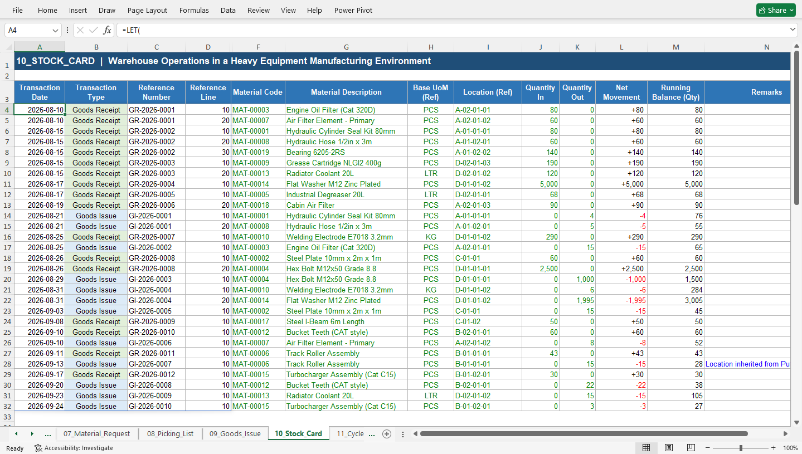
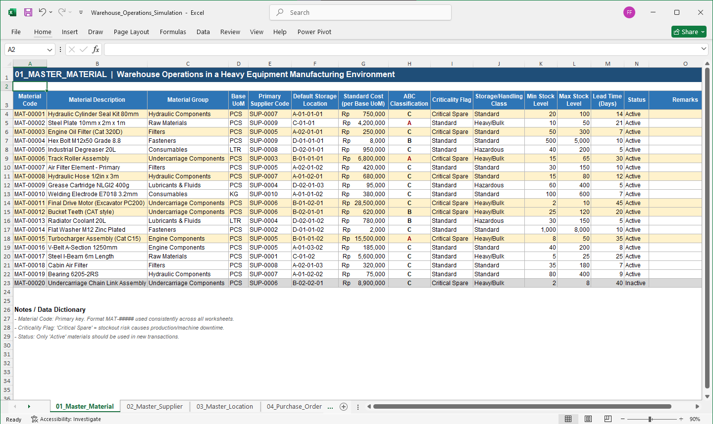
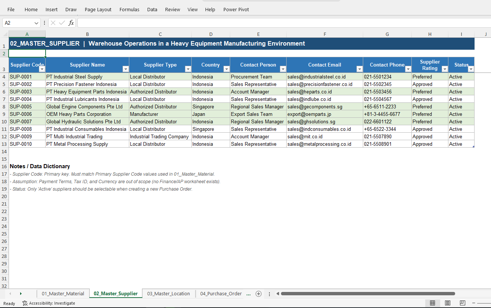
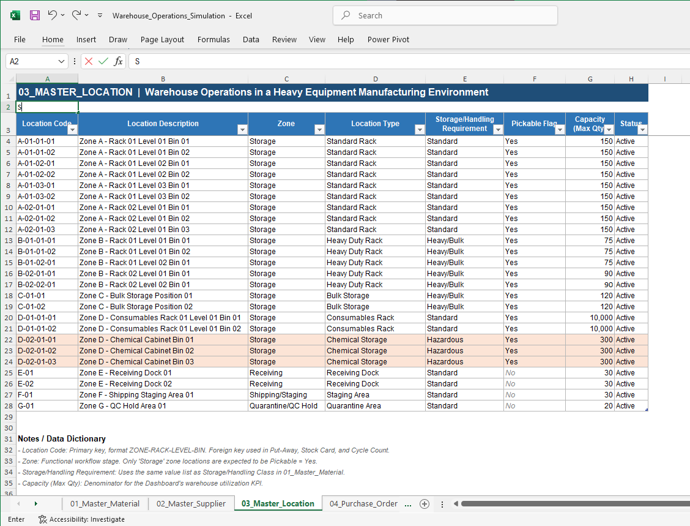

# Warehouse Operations Portfolio

## Introduction
This project is a Microsoft Excel based simulation of warehouse operations in a heavy equipment manufacturing environment. It was created to demonstrate my understanding of warehouse workflows, inventory management, and operational processes.

## Project Background
This project was created as part of my self-directed learning in warehouse operations. It simulates key warehouse processes including Receiving, Put Away, Storage, Material Issue, and Stock Opname using Microsoft Excel to develop a practical understanding of warehouse workflows and inventory management.

## Project Objectives
The objectives of this project are:
-	To simulate real world warehouse operations using Microsoft Excel, covering the complete workflow from receiving goods to inventory reporting.
-	To apply inventory management concepts such as stock movement tracking, stock balance maintenance, and data reconciliation.
-	To develop practical Excel skills for organizing, processing, and analyzing warehouse operational data efficiently.
-	To build a solid understanding of warehouse business processes that serves as a strong foundation for working with ERP and WMS systems.
-	To document and showcase a practical warehouse case study using Excel


## Business Process

### Overview
This project simulates the core warehouse operational workflow commonly found in a heavy equipment manufacturing environment. Rather than focusing on building an ERP or Warehouse Management System (WMS), the project aims to develop a practical understanding of the warehouse business processes that are commonly managed through these systems. Microsoft Excel is used as a simulation tool to model the flow of warehouse data across different operational activities, providing a practical representation of real world warehouse operations.

...

### Warehouse Operations Business Process
The following diagram illustrates the end-to-end warehouse operational workflow simulated throughout this project.

  

### Process Description

| Process | Description |
|----------|-------------|
| Supplier | Approved suppliers provide raw materials or spare parts required for warehouse operations. |
| Purchase Order | A Purchase Order (PO) is created to authorize the purchase of materials from suppliers. |
| Goods Receipt (Receiving) | Incoming materials are received, verified against the Purchase Order, and recorded into inventory. |
| Quality Inspection | Received materials are inspected to ensure they meet quality requirements before being accepted into inventory. |
| Put Away | Approved materials are assigned and transferred to their designated storage locations. |
| Storage | Materials are stored in warehouse locations until they are required for operational use. |
| Inventory Management | Inventory records are maintained to monitor stock levels, locations, and material movements. |
| Goods Request | Internal departments submit requests for materials required for operational or production activities. |
| Picking | Requested materials are picked from their storage locations according to the material request. |
| Goods Issue | Picked materials are issued and recorded as outbound inventory transactions. |
| Cycle Count | Periodic physical inventory counting is performed to verify inventory accuracy. |
| Inventory Adjustment | Inventory records are updated when discrepancies are identified during the cycle count process. |
| Dashboard & Reporting | Warehouse operational data is summarized into reports and dashboards for inventory monitoring and decision-making. |

---
## Excel Implementation

### Stock Card

The Stock Card consolidates inventory movements from Goods Receipt and Goods Issue into a chronological transaction history. It calculates quantity in, quantity out, net movement, and running balance for inventory monitoring.

  

---

## Workbook Structure
The workbook is organized into multiple worksheets, each representing a specific function within the warehouse operation. This structure follows the business process illustrated in the previous section, allowing data to flow logically from purchasing and receiving to inventory control and outbound material handling. 

| Worksheet | Description |
|------------|-------------|
| **01_Master_Material** | Stores the master data for all materials, spare parts, consumables, and finished goods, including item codes, descriptions, categories, units of measure, and inventory-related attributes. |
| **02_Master_Supplier** | Contains supplier master data used as a reference for purchasing transactions and supplier management. |
| **03_Master_Location** | Defines warehouse storage locations such as warehouse, zones, racks, and bins to support inventory organization and traceability. |
| **04_Purchase_Order** | Records purchase orders issued to suppliers before materials are received into the warehouse. |
| **05_Goods_Receipt** | Records incoming materials received from suppliers and updates inventory based on approved purchase orders. |
| **06_Put_Away** | Records the movement of received materials from the receiving area to their designated storage locations. |
| **07_Material_Request** | Records material requests from Production, Sales, Service, Dealers, or Branch Warehouses for outbound warehouse operations. |
| **08_Picking_List** | Generates picking instructions based on approved material requests to support accurate and efficient warehouse picking operations. |
| **09_Goods_Issue** | Records outbound material transactions after picking has been completed and updates inventory accordingly. |
| **10_Stock_Card** | Maintains a complete history of inventory movements, including stock-in, stock-out, and running balances for each material. |
| **11_Cycle_Count** | Records periodic physical inventory counts and identifies discrepancies between physical stock and system inventory. |
| **12_Dashboard** | Presents key warehouse performance indicators (KPIs), inventory summaries, stock movement analysis, and operational insights through interactive visualizations. |

Together, these worksheets illustrate how warehouse master data, operational transactions, inventory control, and performance monitoring can be integrated into a structured warehouse management workflow.

---

## Data Model

The workbook is structured around three core master data tables and a series of warehouse transaction tables.

The master data provides standardized references for materials, suppliers, and warehouse locations, while transaction worksheets record the movement of materials throughout the warehouse process.
### Master Data

The workbook uses three master data sources:

- **01_Master_Material** — Defines material codes, descriptions, categories, units of measure, inventory attributes, and storage/handling requirements:


- **02_Master_Supplier** — Defines supplier information used for purchasing and receiving activities:


- **03_Master_Location** — Defines warehouse storage and handling locations, including warehouse, zone, rack, level, and bin information:


### Transaction Relationships

The main relationships between master data and transaction worksheets are:

```text
01_Master_Material
        │
        ├────────→ 04_Purchase_Order
        │
        ├────────→ 05_Goods_Receipt
        │
        ├────────→ 06_Put_Away
        │
        ├────────→ 07_Material_Request
        │
        ├────────→ 08_Picking_List
        │
        └────────→ 09_Goods_Issue


02_Master_Supplier
        │
        └────────→ 04_Purchase_Order
                         │
                         ↓
                  05_Goods_Receipt


03_Master_Location
        │
        ├────────→ 05_Goods_Receipt
        │
        ├────────→ 06_Put_Away
        │
        ├────────→ 08_Picking_List
        │
        └────────→ 09_Goods_Issue
```

### Document Flow

The transaction worksheets are connected through document references and line-level keys:

```text
Purchase Order
      ↓
Goods Receipt
      ↓
Put Away
```

and:

```text
Material Request
      ↓
Picking List
      ↓
Goods Issue
```

### Inventory Transaction Flow

The Stock Card consolidates inventory movements from both inbound and outbound transactions:

```text
Goods Receipt ───────→ Stock Card
   Stock In              │
                         ↓
                   Running Balance
                         ↑
   Stock Out             │
Goods Issue ─────────────┘
```

Goods Receipt represents an inbound inventory transaction, while Goods Issue represents an outbound inventory transaction.

Put Away is treated as a warehouse location movement after receiving and is not treated as a separate stock-in transaction in the Stock Card.

The Stock Card therefore acts as the central inventory transaction history, consolidating stock-in and stock-out movements and maintaining the running balance for each material.

### Key Reference Relationships

The workbook uses document numbers, line numbers, material codes, supplier codes, and location codes to maintain transaction traceability.

Examples include:

- Material Code → Master Material
- Supplier Code → Master Supplier
- Location Code → Master Location
- PO Number + PO Line → Goods Receipt
- GR Number + GR Line → Put Away
- Request Number + Request Line → Picking List
- Request Number + Request Line → Goods Issue
- Goods Receipt + Goods Issue → Stock Card

Helper keys are used where necessary to maintain line-level relationships between operational documents.

---

## Excel Features

The workbook uses Microsoft Excel features to simulate warehouse administration, inventory control, and transaction processing.

Key Excel features used in the project include:

- Excel Tables
- Structured References
- Data Validation
- Conditional Formatting
- Lookup Functions
- Conditional Aggregation
- Dynamic Array Functions
- Automated Inventory Transaction Consolidation

### Excel Tables

Master and transaction data are structured as Excel Tables to support:

- Structured references
- Automatic formula expansion
- Filtering and sorting
- Consistent data entry
- Easier maintenance of transaction records

### Data Validation

Dropdown lists are used for controlled fields such as:

- Request Priority
- Approval Status
- Request Status
- Warehouse classifications
- Other standardized operational fields

This helps reduce inconsistent manual entries.

### Conditional Formatting

Conditional formatting is used to highlight important operational information such as:

- Urgent requests
- Pending or rejected transactions
- Inventory variances
- Operational statuses
- Other warehouse exceptions

---

## Excel Formulas & Technical Implementation

The project applies Excel formulas and structured references to support practical warehouse activities such as master data retrieval, inventory validation, transaction consolidation, quantity tracking, and stock balance monitoring.

Rather than using Excel only for data entry, formulas are applied to simulate how warehouse transaction data can be processed and connected.

### Key Excel Formulas & Functions

| Formula / Function | Application | Warehouse Use Case |
|---|---|---|
| `XLOOKUP` | Reference data retrieval | Retrieves related master data such as material descriptions, Base UoM, supplier information, and other reference data. |
| `VLOOKUP` | Reference data retrieval | Retrieves related information from reference tables where the lookup key is positioned in the first column. |
| `SUMIFS` | Conditional aggregation | Calculates quantities based on multiple criteria, such as total issued quantity for a specific Material Request and Request Line. |
| `IF` | Conditional logic | Handles business conditions, exceptions, and validation logic. |
| `VSTACK` | Vertical data consolidation | Combines Goods Receipt and Goods Issue transaction records into the Stock Card transaction history. |
| `HSTACK` | Horizontal data consolidation | Combines related fields from different sources when constructing consolidated datasets. |
| Structured References | Table-based formulas | References Excel Table columns using field names instead of fixed cell ranges. |

### XLOOKUP — Master Data Retrieval

`XLOOKUP` is used to retrieve related information from master data and transaction worksheets.

Example:

```excel
=XLOOKUP([@[Material Code]],tbl_MasterMaterial[Material Code],tbl_MasterMaterial[Material Description],"")
```

This reduces repetitive manual data entry and helps maintain consistency between transaction worksheets and master data.

### VLOOKUP — Reference Data Retrieval

`VLOOKUP` is used in selected areas where the lookup key is positioned in the first column of the reference table.

Example:

```excel
=VLOOKUP([@[Material Code]],tbl_MasterMaterial[[Material Code]:[Base UoM]],5,FALSE)
```

The project therefore demonstrates the use of both traditional and modern Excel lookup techniques.

### SUMIFS — Transaction Quantity Tracking

`SUMIFS` is used to calculate transaction quantities based on multiple criteria.

For example, the Material Request worksheet can calculate the total quantity issued against a specific request line:

```excel
=SUMIFS(
tbl_GoodsIssue[Quantity Issued],
tbl_GoodsIssue[Request Number],[@[Request Number]],
tbl_GoodsIssue[Request Line],[@[Request Line]]
)
```

This supports partial fulfillment scenarios where one Material Request may be fulfilled through multiple Goods Issue transactions.

### IF — Conditional Business Logic

`IF` is used throughout the workbook to handle business conditions and prevent inappropriate calculations.

For example:

```excel
=IF([@[Ordered Qty]]=0,"",([@[Received Qty]]-[@[Ordered Qty]])/[@[Ordered Qty]])
```

This prevents division-by-zero errors and keeps the worksheet easier to interpret.

### VSTACK — Stock Card Transaction Consolidation

`VSTACK` is used to consolidate inbound and outbound warehouse transactions into a single Stock Card transaction history.

Conceptually:

```excel
=VSTACK(
    Goods_Receipt_Transactions,
    Goods_Issue_Transactions
)
```

This allows the Stock Card to combine Goods Receipt and Goods Issue records without manually copying transactions between worksheets.

The consolidated transaction history is then used to calculate inventory movement and running balances.

### HSTACK — Horizontal Data Consolidation

`HSTACK` is used when related fields from different data sources need to be combined horizontally into a single dataset.

Conceptually:

```excel
=HSTACK(
    Source_Data_1,
    Source_Data_2
)
```

This dynamic-array approach supports the construction of consolidated transaction data while keeping the original operational worksheets separated according to their respective warehouse processes.

### Structured References

The workbook uses Excel Tables and structured references to improve formula readability and maintainability.

For example:

```excel
tbl_GoodsIssue[Quantity Issued]
```

is used instead of fixed cell ranges such as:

```excel
M2:M100
```

This allows formulas to accommodate additional transaction rows as the dataset grows.

### Formula Design Approach

The project follows a simple data-processing approach:

```text
Manual Input
     ↓
Reference / Lookup
     ↓
Calculation
     ↓
Validation
     ↓
Operational Status
     ↓
Inventory Transaction
```

For example:

```text
Material Request
      ↓
Reference / Lookup
      ↓
Stock Sufficiency Check
      ↓
Approval
      ↓
Picking List
      ↓
Goods Issue
      ↓
Stock Card
```

This approach separates manual operational inputs from reference data and calculated fields, making the workbook easier to understand, maintain, and audit.

---

## Dashboard


---

## Project Highlights

The project demonstrates an end-to-end warehouse operations simulation for a heavy equipment manufacturing environment.

Key highlights include:

- Designed an end-to-end warehouse business process covering inbound, storage, inventory, and outbound activities.
- Developed master data structures for materials, suppliers, and warehouse locations.
- Created a Purchase Order transaction process.
- Simulated Goods Receipt activities, including received quantity, accepted quantity, rejected quantity, delivery status, and variance monitoring.
- Incorporated Put Away activities to represent the movement of received materials from receiving areas into warehouse storage locations.
- Developed a Material Request process for internal material requirements.
- Created a Picking List to simulate warehouse picking activities.
- Developed a Goods Issue process to record outbound inventory transactions.
- Built a Stock Card that consolidates Goods Receipt and Goods Issue transactions.
- Implemented running inventory balances based on inbound and outbound movements.
- Applied lookup, conditional aggregation, and dynamic array formulas to support warehouse transaction processing.
- Used line-level reference keys to improve transaction traceability across operational documents.
- Applied Excel Tables, structured references, data validation, and conditional formatting to improve usability and data consistency.

The project is designed not only as an Excel exercise, but also as a demonstration of warehouse process understanding, inventory control, document traceability, and operational administration.

